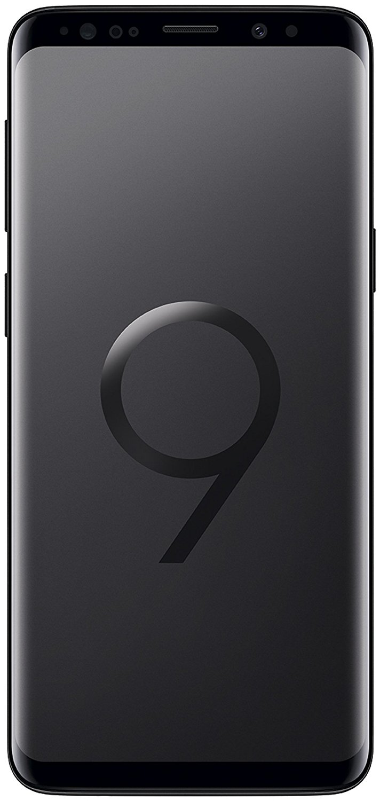

Rooter un Samsung Galaxy [Tuto]
-------------------------------

Dans ce tutoriel je vous propose d'apprendre la meilleure façon pour *rooter* votre smartphone **Samsung Galaxy** étape par étape.
Cette méthode devrait fonctionner pour tous les **Samsung Galaxy** y compris pour le dernier modèle **Samsung Galaxy S10** qui vient juste de sortir (aussitôt que le TWRP sera disponible).

    
    
    
    
    
    
    

Avant tout, je vous déconseille fortement l'utilisation de **King Root**, qui va installer **KingrootSU** à la place du **SuperSU** standard dont il sera très difficile de se débarrasser ensuite.
Si vous êtes dans cette situation et que vous souhaitez supprimer **KingRoot** complètement je vous recommande d'utiliser **<a href="https://play.google.com/store/apps/details?id=darkslide.com.supersumepro" target="_blank" rel="noopener noreferrer nofollow">Super-SUMe</a>**, si vous ne souhaitez pas acheter la version pro, il existe également une version qui se finance par la publicité.

1. <a href="#telecharger-et-installer-les-pilotes-usb-android">Télécharger et installer les **pilotes USB Android**</a>
2. <a href="#telecharger-et-installer-odin">Télécharger et installer **Odin**</a>
3. <a href="#telecharger-le-custom-recovery-twrp">Télécharger le **"Custom Recovery" (TWRP)**</a>
4. <a href="#telecharger-le-fichier-de-root-flashable-supersu">Télécharger le **fichier de root flashable (SuperSU)**</a>
5. <a href="#desactivez-le-verouillage-oem-de-votre-smartphone">**Désactivez le vérouillage OEM** de votre smartphone</a>
6. <a href="#redemarrer-son-samsung-galaxy-en-mode-download">Redémarrer son **Samsung Galaxy** en mode *"Download"*</a>
7. <a href="#flasher-le-twrp-sur-son-samsung-galaxy">**Flasher le TWRP** sur son Samsung Galaxy</a>
8. <a href="#utiliser-twrp-pour-installer-le-root-et-supersu">Utiliser TWRP pour **installer le root et SuperSu**</a>

Astuces Bonus:

- <a href="#comment-flasher-une-rom-custom">Comment Flasher Une ROM Custom</a>
- <a href="#comment-restaurer-mon-samsung-galaxy-dans-son-etat-dorigine">Comment restaurer mon Samsung Galaxy dans son état d’origine</a>

Télécharger et installer les Pilotes USB Android
------------------------------------------------

Comment installer les pilotes usb de votr téléphone ? C'est très simple, sous **Windows 10** les pilotes USB pour smartphones android devraient être disponibles par défaut. 
Si ce n'est pas le cas ou que vous utilisez une autre version de Windows, téléchargez le fichier *<a href="https://developer.samsung.com/galaxy/others/android-usb-driver-for-windows" target="_blank" rel="noopener noreferrer nofollow">SAMSUNG_USB_Driver_for_Mobile_Phones.zip</a>* sur la page officielle Samsung : **<a href="https://developer.samsung.com/galaxy/others/android-usb-driver-for-windows" target="_blank" rel="noopener noreferrer nofollow">https://developer.samsung.com/galaxy/others/android-usb-driver-for-windows</a>**
Décompressez l'archive et exécutez le programme d'installation des *drivers* de votre appareil android.

Télécharger et installer Odin
-----------------------------

**Odin** est le logiciel *Windows* qui permet de *"flasher"* une *rom*  sur votre smartphone. Téléchargez la version 3.13.1 de **<a href="https://samsungodin.com" target="_blank" rel="noopener noreferrer nofollow">Odin</a>** (**<a href="https://samsungodin.com" target="_blank" rel="noopener noreferrer nofollow">https://samsungodin.com</a>**) et installez l'application sur votre ordinateur.

Télécharger le "Custom Recovery" (TWRP)
---------------------------------------

**TWRP** est l'acronyme de *"TeamWin Recovery Project"*, c'est un firmware custom tactile en mode graphique pour remplacer la partition de *"recovery"* de votre smartphone.
Les fichiers sont disponibles sur la page de la communauté **<a href="https://twrp.me" target="_blank" rel="noopener noreferrer nofollow">TeamWin</a>** à **<a href="https://twrp.me" target="_blank" rel="noopener noreferrer nofollow">cette adresse</a>**: **<a href="https://twrp.me" target="_blank" rel="noopener noreferrer nofollow">https://twrp.me</a>**.

Téléchargez le firmware TWRP qui correspond au modèle de votre smartphone **<a href="https://twrp.me/Devices" target="_blank" rel="noopener noreferrer nofollow">ici</a>** : **<a href="https://twrp.me/Devices" target="_blank" rel="noopener noreferrer nofollow">https://twrp.me/Devices</a>**

Par exemple, le modèle exact de mon téléphone **Samsung Galaxy J5** est **<a href="https://eu.dl.twrp.me/j5nlte" target="_blank" rel="noopener noreferrer nofollow">SM-J500FN</a>**, le TWRP correspondant est disponible **<a href="https://eu.dl.twrp.me/j5nlte" target="_blank" rel="noopener noreferrer nofollow">ici</a>**: **<a href="https://eu.dl.twrp.me/j5nlte" target="_blank" rel="noopener noreferrer nofollow">https://eu.dl.twrp.me/j5nlte</a>**
Attention, pour certains smartphones le fichier ne va peut-être pas fonctionner ou ne sera tout simplement pas disponible. Cette opération se fait à vos risques et périls.

Télécharger le fichier de root flashable (SuperSU)
--------------------------------------------------

*"SuperSU"* est l'application android qui permet de gèrer les autorisations utilisateurs et les accès *"root"*, c'est une fonctionalité indispensable pour la sécurité de votre téléphone.

Vous devez maintenant télécharger le fichier de *"Super SU"* au format *.zip* en version *"Recovery Flashable"* qui vous permettra d'effectivement *"rooter"* votre système.
Je vous recommande la version "UPDATE-SuperSU-v2.82-20170528234214.zip" si elle est disponible.
J'ai pu la trouver **<a href="https://download.chainfire.eu/1113/SuperSU/UPDATE-SuperSU-v2.82-20170528234214.zip" target="_blank" rel="noopener noreferrer nofollow">ici</a>** : **<a href="https://download.chainfire.eu/1113/SuperSU/UPDATE-SuperSU-v2.82-20170528234214.zip" target="_blank" rel="noopener noreferrer nofollow">https://download.chainfire.eu/1113/SuperSU/UPDATE-SuperSU-v2.82-20170528234214.zip</a>**

Au moment ou j'écris ces lignes le fichier **<a href="http://www.supersu.com/download" target="_blank" rel="noopener noreferrer nofollow">SuperSU-v2.82-201705271822.zip</a>** n'est pas disponible sur le site **<a href="http://www.supersu.com/download" target="_blank" rel="noopener noreferrer nofollow">supersu.com</a>**
mais vous pourrez peut être le trouver **<a href="https://download.chainfire.eu/1220/SuperSU" target="_blank" rel="noopener noreferrer nofollow">ici</a>**: **<a href="https://download.chainfire.eu/1220/SuperSU" target="_blank" rel="noopener noreferrer nofollow">https://download.chainfire.eu/1220/SuperSU</a>**

Sinon, je vous suggère de faire une recherche google sur ce fichier.

Désactivez le vérouillage OEM de votre smartphone
-------------------------------------------------

D'abord, activez le **"mode développeur"**, entrez dans les **"Paramètres"**, puis ouvrez le menu **"À propos de l'appareil"** puis cliquez une dizaine de fois sur le **"Numéro de version"**.

Le menu **"Options de développement"** devrait apparaitre dans les paramètres, activez l'option **"Déverrouillage OEM"**.

Si vous n'activez pas cette option, il sera impossible de démarrer votre téléphone après le *root* et vous serez obligé de flasher votre téléphone avec une *ROM* officele pour pour l'utiliser à nouveau.

Redémarrer son Samsung Galaxy en mode "Download"
------------------------------------------------

Par sécurité assurez vous d'avoir suffisament de batterie (au moins 50%), puis éteingnez votre smartphone. Je vous recommande également de faire une sauvegarde de vos donnée avant d'aller plus loin.

Pour redémarrer en mode *"Download"* maintenez enfoncés les boutons <kbd>Volume -</kbd> <kbd>Home</kbd> <kbd>Power</kbd> (**Volume -**, **Accueil** et **Mise en route**).
Quand votre téléphone vibre, vous pouvez relâcher le bouton **Power** en maintenant les 2 autres appuyés, jusqu'à ce qu'un message s'affiche.

Pour passer l'avertissement de sécurité du **Bootloader** de votre Samsung Galaxy appuyez sur le bouton <kbd>Volume +</kbd> pour entrer dans le mode **Download**.
Une fois dans le mode *"Download"*, brancher le smartphone sur le PC, et patientez que *Windows* installe les pilotes USB et que *Odin* détecte le smartphone.

Flasher le TWRP sur son Samsung Galaxy
--------------------------------------

Si vous ne l'avez pas déjà fait ouvrez *Odin* puis cliquez sur le boutnon *"AP"* et sélectionnez le fichier **TWRP-recovery** que vous avez téléchargé (il doit être en .tar ou .tar.md5)

Avant de cliquer sur *Start*, vérifiez que toutes les cases sont cochées comme sur l'image ci-dessus.

1. Lorque vous branchez votre smartphone en mode *"download"*, le message *"ID:COM"* s'active dans l'interface *d'Odin*.
2. Cliquez sur l'onglet *"Options"*.
3. La case *"Auto-Reboot"* n'est pas indispensable, elle permet simplement de redémarrer votre téléphone automatiquement à la fin de l'opération.
4. La case *"Re-Partition"* **ne doit surtout pas être cochée**, sinon vous risquez d'endommager votre téléphone.
5. La case *"F. Reset Time"* doit être cochée également.
6. Dans le cadre de droite, la case *"AP"* doit être cochée et le champ associé doit contenir le chemin vers le fichier que vous souhiatez flasher.
7. **Ne débranchez surtout pas votre smartphone** après avoir appuyé sur le bouton *"Start"*.

Quand vous verrez le message **"PASS"** en vert, débranchez le câble USB et allumez votre smartphone, s'il se bloque au démarrage, démarrer le en mode Recovery (<kbd>Volume +</kbd> <kbd>Home</kbd> <kbd>Power</kbd>) et faites un *Wipe Data/Factory Reset*.

Redémarrer son Samsung Galaxy en mode "Recovery"
------------------------------------------------

Pour redémarrer en mode *"Recovery"* maintenez enfoncés les boutons <kbd>Volume +</kbd>, <kbd>Home</kbd>, <kbd>Power</kbd> quand votre téléphone vibre, vous pouvez relâcher le bouton d'alimentation mais maintenez enfoncé les 2 autres.

Utiliser TWRP pour installer le root et SuperSu
-----------------------------------------------

Connectez votre téléphone et copiez l'archive **"SuperSU"** sur la carte SD de votre smartphone.
Redémarrer votre téléphone en mode *"Recovery"*, accèdez au menu pour *flasher* le *root*.

Cliquez sur *"Install"*, selectionnez le fichier **"SuperSU"** que vous avez précédemment copié, puis cliquez sur le bouton *"Install Image"*.
Redémarrez votre téléphone quand l'opération est terminée.

Si votre téléphone se bloque au démarrage, démarrer le en mode *"Recovery"* (<kbd>Volume +</kbd> <kbd>Home</kbd> <kbd>Power</kbd>) et faites un *"Wipe Data/Factory Reset"*. (Attention: Toutes les données de votre téléphone seront perdues si vous ne les aviez pas précédemment sauvegardées).

Pourquoi rooter mon Samsung Galaxy ?
------------------------------------

Voilà votre smartphone **Samsung Galaxy** est rooté, vous pouvez maintenant utiliser votre appareil sans limitations. Par exemple vous pouvez maintenant:

- Supprimer les applications système superflues avec "**<a href="https://play.google.com/store/apps/details?id=com.jumobile.manager.systemapp" target="_blank" rel="noopener noreferrer nofollow">Désinstalleur App Sytème</a>**"
- Sauvegarder vos application et vos données avec "**<a href="https://play.google.com/store/apps/details?id=com.keramidas.TitaniumBackup" target="_blank" rel="noopener noreferrer nofollow">Titanium Backup</a>**"
- Bloquer les publicités avec "**<a href="https://adaway.org" target="_blank" rel="noopener noreferrer nofollow">AdAway</a>**"
- Mettre en place des règles de pare feu avec "**<a href="https://play.google.com/store/apps/details?hl=en&id=dev.ukanth.ufirewall" target="_blank" rel="noopener noreferrer nofollow">AFWall+</a>**"
- Accèder à la racine de votre appareil avec **<a href="http://www.estrongs.com" target="_blank" rel="noopener noreferrer nofollow">ES Explorateur de Fichiers</a>**
- Utiliser toute la puissance d'Android en ligne de commande avec "**<a href="https://play.google.com/store/apps/details?id=com.termux" target="_blank" rel="noopener noreferrer nofollow">Termux</a>**"

Attention, à partir du moment où vous aurez rooté votre smartphone, **vous ne pourrez plus bénéficier de la mise à jour automatique de votre système**.
Vous devrez faire cette mise à jour manuellement avec *Odin* en suivant la procédure décrite au chapitre <a href="#comment-restaurer-mon-samsung-galaxy-dans-son-etat-dorigine">Comment restaurer mon Samsung Galaxy dans son état d'origine</a>.

Comment Flasher Une ROM Custom
==============================

Télécharger une ROM custom
--------------------------

Les ROMs cutoms sont devenues beaucoup moins pertinentes surtout depuis que **CyanogenMod** à disparu et aussi il faut avouer que les ROMs officielles **Samsung** ont étées vraiment améliorées.
Mais si toutefois il vous prenait l'envie d'éssayer **Lineage** le successseur de **CyanogenMod** ou une autre ROM custom de votre préférence, je vous propose de suivre ces quelques conseils.

Il y a au moment ou j'écris ces lignes surtout trois principales ROMs custom intéressantes à tester sur votre **Samsung Galaxy**, vous pouvez les télécharger sur les pages suivvantes:

- **<a href="https://download.lineageos.org" target="_blank" rel="noopener noreferrer nofollow">Lineage</a>**: **<a href="https://download.lineageos.org" target="_blank" rel="noopener noreferrer nofollow">https://download.lineageos.org</a>**
- **<a href="http://download.dirtyunicorns.com" target="_blank" rel="noopener noreferrer nofollow">Dirty Unicorns</a>**: **<a href="http://download.dirtyunicorns.com" target="_blank" rel="noopener noreferrer nofollow">http://download.dirtyunicorns.com</a>**
- **<a href="https://slimroms.org/#/download" target="_blank" rel="noopener noreferrer nofollow">Slimroms</a>**: **<a href="https://slimroms.org/#/download" target="_blank" rel="noopener noreferrer nofollow">https://slimroms.org/#/download</a>**

Flashez la ROM custom
---------------------

Appliquez les étapes 6 et 7 de ce tutoriel, mais sélectionnez la ROM custom que vous avez téléchargée dans le champm *"AP"* *d'Odin*.

6. <a href="#redemarrer-son-samsung-galaxy-en-mode-download">Redémarrer son **Samsung Galaxy** en mode *"Download"*</a>
7. <a href="#flasher-le-twrp-sur-son-samsung-galaxy">**Flasher le TWRP** sur son Samsung Galaxy</a>

Comment restaurer mon Samsung Galaxy dans son état d'origine
============================================================

Télécharger le Firmware Samsung
-------------------------------

Téléchargez le firmware pour votre smartphone, vous pouvez en trouver sur le site ****[Sammobile](http://www.sammobile.com/firmwares) (en anglais) ([http://www.sammobile.com/firmwares](http://www.sammobile.com/firmwares))
ou ****[Phonandroid](https://www.phonandroid.com)

Attention vous devez télécharger le firmware (la ROM) qui correspond au *"Numéro du modèle"* exact de votre smartphone.
Vous le trouverez dans le menu *"À propos de l'appareil"* dans les *"Paramètres"* de votre téléphone.

Par exemple je possède un **Samsung Galaxy J3**, le numéro de modèle exact est **SM-J320FN**, j'ai pu trouver les ROMs Samsung officielles ici:
- **<a href="https://www.sammobile.com/firmwares/galaxy-j3/SM-J320FN" target="_blank" rel="noopener noreferrer nofollow">https://www.sammobile.com/firmwares/galaxy-j3/SM-J320FN</a>**
- **<a href="https://www.phonandroid.com/forum/threads/roms-liste-des-roms-officielles-pour-samsung-galaxy-j3-sm-j320fn.147869" target="_blank" rel="noopener noreferrer nofollow">https://www.phonandroid.com/forum/threads/roms-liste-des-roms-officielles-pour-samsung-galaxy-j3-sm-j320fn.147869</a>**

Je possède aussi un **Samsung Galaxy J5**, son numéro de modèle est **SM-J500FN**
- **<a href="https://www.sammobile.com/firmwares/galaxy-j5/SM-J500FN" target="_blank" rel="noopener noreferrer nofollow">https://www.sammobile.com/firmwares/galaxy-j5/SM-J500FN</a>**
- **<a href="https://www.phonandroid.com/forum/threads/roms-liste-des-roms-officielles-pour-samsung-galaxy-j5-sm-j500fn.129968" target="_blank" rel="noopener noreferrer nofollow">https://www.phonandroid.com/forum/threads/roms-liste-des-roms-officielles-pour-samsung-galaxy-j5-sm-j500fn.129968</a>**

Flashez le Firmware Samsung
---------------------------

Appliquez les étapes 6 et 7 de ce tutoriel, mais sélectionnez la ROM officielle que vous avez précédemment téléchargé dans le champ *"AP"* *d'Odin*.

6. <a href="#redemarrer-son-samsung-galaxy-en-mode-download">Redémarrer son **Samsung Galaxy** en mode *"Download"*</a>
7. <a href="#flasher-le-twrp-sur-son-samsung-galaxy">**Flasher le TWRP** sur son Samsung Galaxy</a>

Après l'opération, la partition de *"recovery"* sera aussi remplacée (pour une raison que j'ignore).

Redémarrez votre téléphone, s'il se bloque démarrez le en mode *"Recovery"* (<kbd>Volume +</kbd> <kbd>Home</kbd> <kbd>Power</kbd>) et faites un *"Wipe Data/Factory Reset"*. (Attention: Toutes les données de votre téléphone seront perdues si vous ne les aviez pas précédemment sauvegardées).